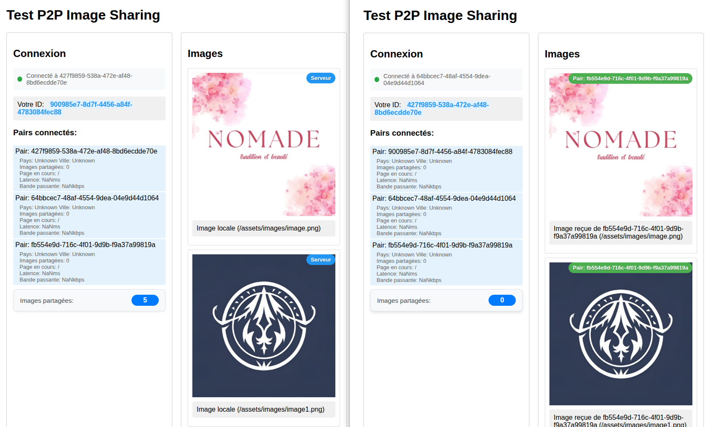

# Application de Partage P2P d'Images

Cette application web permet de partager des images entre utilisateurs en utilisant la technologie P2P (Peer-to-Peer), réduisant ainsi la charge sur le serveur et optimisant la bande passante.



## Fonctionnalités

- Partage automatique des images entre les utilisateurs connectés
- Mise en cache des images pour une distribution P2P
- Interface utilisateur simple et intuitive
- Affichage du statut de chargement des images
- Utilisation de WebRTC pour les connexions P2P
- Gestion intelligente des pairs basée sur la qualité de connexion
- Mesure de la latence et de la bande passante

## Architecture Technique

L'application est composée de plusieurs composants :

### Frontend
- `client/` : Dossier contenant l'application frontend
  - `js/app.js` : Logique principale de l'application
  - `js/config.js` : Configuration de l'application
  - `assets/` : Images et ressources statiques

### Backend
- `server/` : Dossier contenant le serveur de découverte
  - `server.js` : Serveur de découverte pour la gestion des pairs
  - `package.json` : Dépendances du serveur

### Documentation et Tests
- `docs/` : Documentation technique
- `tests/` : Tests unitaires et d'intégration

## Comment ça marche

1. **Initialisation**
   - Lorsqu'un utilisateur charge la page, une connexion P2P est établie via WebRTC
   - Un ID unique est généré pour chaque utilisateur
   - Le serveur de découverte mesure la qualité de connexion (latence et bande passante)
   - Les connexions avec les meilleurs pairs sont établies automatiquement

2. **Gestion des Pairs**
   - Le serveur maintient une liste des meilleurs pairs disponibles
   - Les pairs sont triés par score de qualité de connexion
   - La liste est réinitialisée toutes les 10 secondes
   - Les pairs inactifs sont nettoyés toutes les 5 secondes

3. **Chargement des images**
   - Quand une image est demandée, le système vérifie d'abord si elle est disponible via P2P
   - Si l'image est trouvée chez un pair, elle est récupérée directement
   - Sinon, l'image est chargée depuis le serveur et mise en cache pour les autres pairs

4. **Qualité de Connexion**
   - La latence est mesurée via des pings réguliers
   - La bande passante est testée avec des transferts de données
   - Le score de qualité est calculé comme : `(bandwidth / 1000) / latency`
   - Les pairs sont triés par score décroissant

## Installation

1. Clonez le dépôt :
```bash
git clone [URL_DU_REPO]
cd p2p-image-sharing
```

2. Installez les dépendances :
```bash
# Dépendances du serveur
cd server
npm install

# Dépendances du client
cd ../client
npm install
```

3. Démarrez le serveur :
```bash
cd ../server
npm start
```

4. Ouvrez votre navigateur à l'adresse : `http://localhost:3000`

## Configuration

### Serveur de Découverte
Les paramètres du serveur sont configurables dans `server/server.js` :
```javascript
const MAX_PEERS = 10;           // Nombre maximum de pairs
const RESET_INTERVAL = 10000;   // Intervalle de réinitialisation (10s)
const HEARTBEAT_TIMEOUT = 5000; // Timeout pour les pairs inactifs (5s)
```

### Client
Les paramètres du client sont configurables dans `client/js/config.js` :
- URL du serveur de découverte
- Configuration WebRTC
- Paramètres de connexion P2P

## API du Serveur de Découverte

### Enregistrement d'un pair
```http
POST /register
Content-Type: application/json

{
    "peerId": "string",
    "address": "string",
    "country": "string",
    "city": "string",
    "connectionQuality": {
        "latency": number,
        "bandwidth": number
    }
}
```

### Mise à jour du statut (heartbeat)
```http
POST /heartbeat
Content-Type: application/json

{
    "peerId": "string",
    "connectionQuality": {
        "latency": number,
        "bandwidth": number
    }
}
```

### Liste des pairs disponibles
```http
GET /peers
```

### Test de latence
```http
POST /ping
```

### Test de bande passante
```http
GET /bandwidth-test
```

## Dépendances

### Frontend
- **PeerJS** : Bibliothèque pour simplifier l'utilisation de WebRTC

### Backend
- **Express** : Serveur web
- **CORS** : Gestion des requêtes cross-origin

## Limitations

- Nécessite un navigateur moderne supportant WebRTC
- Les connexions P2P peuvent être bloquées par certains pare-feu
- La taille des images partagées est limitée par la mémoire disponible

## Contribution

Les contributions sont les bienvenues ! N'hésitez pas à :
1. Fork le projet
2. Créer une branche pour votre fonctionnalité
3. Commiter vos changements
4. Pousser vers la branche
5. Ouvrir une Pull Request

## Licence

Ce projet est sous licence MIT. Voir le fichier `LICENSE` pour plus de détails. 